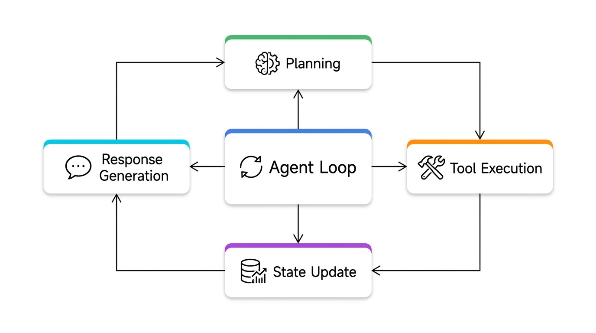
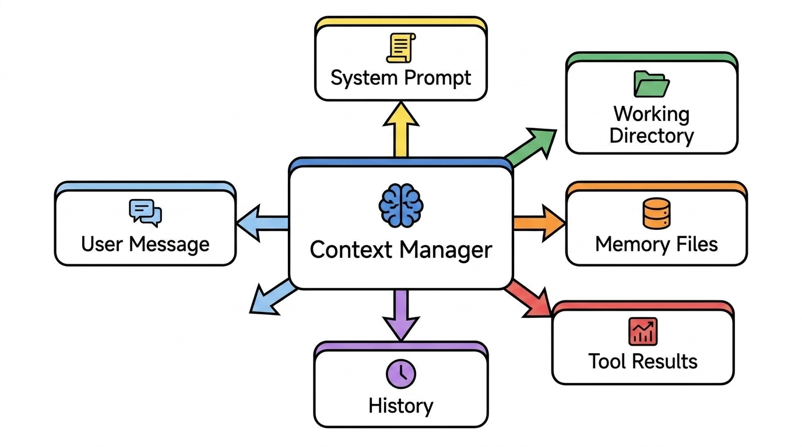
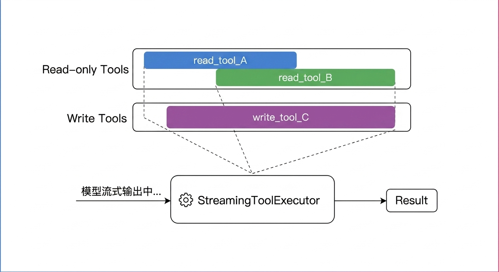

# Gracker Diagrams Skill

基于 [baoyu-infographic](../baoyu-infographic/) 抽取改造的 Gracker 自用画图 Skill。

## 源 Skill

[baoyu-infographic](https://github.com/openclaw/skills/tree/main/baoyu-infographic) — 保留了其完整流程框架和布局/风格分类体系，风格定义全部替换为 Gracker 的偏好。

## 与 baoyu 的核心差异

| 维度 | baoyu-infographic | gracker-diagrams |
|------|-------------------|-----------------|
| 风格 | 论文手绘信息图 | 白板草图精修版（visual abstract） |
| 字体 | 默认分选两套 | 中英文同源（LXGW WenKai） |
| 标题 | 常见大标题区块 | 默认关闭，模块即标题 |
| 信息密度 | 偏密 | **随内容变化**，该密则密，该疏则疏，以清晰可读为准 |
| Perfetto | 默认增强 | 按需，非标配 |
| 美感约束 | 无 | 居中/对称留白/注释≠模块 |
| 比例 | 常用 16:9 | 不写死，内容决定尺寸 |

## 核心约束（硬规则）

1. **纯白底**，不能偏黄/牛皮纸
2. **中英文同源字体**：LXGW WenKai，禁止混用两套
3. **内容居中 + 对称留白**：内容占画布 65-75%
4. **垂直居中**：不允许偏上/偏下
5. **不写死宽高比**
6. **标题默认关闭**
7. **图片是关系图，不是信息容器**
8. **注释标签 ≠ 流程节点**：纯文字，无边框
9. **Perfetto tracks 按需**：只有真实 timing 数据才加

## 风格参照

- **构图**：`01-main-structure.png`（Claude Code 架构指南中的白板精修版）
- **字体**：`10-two-tier-state-v2.jpg`（稳、轻、技术感）
- **布局范本**：`11-mcp-protocol-v3.jpg`（构图/边框/留白节奏最佳）

## 文件结构

```
gracker-diagrams/
├── SKILL.md                          # 主流程
├── README.md                         # 本文件
├── references/
│   ├── style-guide.md                # 风格定义（6 要素 + 禁止项 + 美感硬约束）
│   ├── layout-map.md                  # 布局决策表
│   ├── prompt-template.md             # prompt 模板
│   └── quality-checklist.md           # 质量验收清单
└── scripts/
    └── init_diagram_run.py            # 目录初始化
```

## Samples（展示能力）

四张示例，展示不同主题、布局和信息密度：

| 编号 | 主题 | 布局 | 密度 |
|------|------|------|------|
| 01 | Agent Loop 迭代循环 | hub-spoke | 稀疏 |
| 02 | Tool 执行管道 5 阶段 | linear pipeline | 中等 |
| 03 | Context 架构分解 | structural breakdown | 中等偏密 |
| 04 | 并发执行 + Perfetto tracks | timeline + hub | 中等 |

### 01 - Agent Loop


### 02 - Tool 执行管道


### 03 - Context 架构


### 04 - 并发执行 + Perfetto


---

## 使用方式

1. 读 `SKILL.md`
2. 读 `references/style-guide.md` 确认当前约束
3. 读 `references/layout-map.md` 选布局
4. 按 `references/prompt-template.md` 组装 prompt
5. 生成 + `references/quality-checklist.md` 验收
6. 不满意：针对性改 prompt 重试，最多 2 轮
