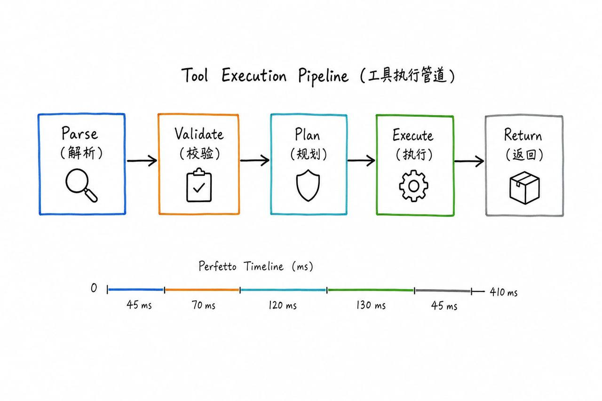

# gracker-diagrams

面向技术内容的 AI 画图 Skill，两种风格一键切换。

## 风格

| | 白板架构图（默认） | 马卡龙信息图 |
| --- | --- | --- |
| 背景 | 纯白白板 | 暖奶油纸 #F5F0E8 |
| 色块 | 外框描色，不填满 | 马卡龙色圆角卡片 |
| 箭头 | 正交直角 | 手绘波浪线 |
| 图标 | 黑白线条简笔画 | 卡通 + 涂鸦装饰 |
| 标题 | 弱化/可省 | 粗体大号手绘字居中 |
| 布局 | 横屏 16:9 | 竖屏 3:4 |
| 底部 | 无 | 金句收束 |
| 适用 | 系统架构、模块关系、Mermaid 转图 | 知识总结、方法论、Skill 概览、框架图 |

## 安装

### ClawHub

```bash
clawhub install gracker-diagrams
```

### 手动

把 `gracker-diagrams/` 放入 skills 目录即可。

## 触发词

**白板架构图**：架构图、系统图、模块关系、Mermaid 转图、流程图、时序图、白板图、画图

**马卡龙信息图**：信息图、infographic、单页摘要、竖屏图、长图、知识总结图、框架图、Skill 概览图

## 工作流程

```
原始内容 → 分析结构 → 选布局 → 生成 prompt → 出图 → 验收
```

每种风格有独立的 style guide 和 prompt template，详见 `references/` 目录。

## 依赖

- OpenClaw（或任何支持 Skill 格式的 AI agent 运行时）
- `image_generate` 工具（文生图后端）

## Samples

### 白板架构图

| Hub-Spoke（Agent Loop） | Linear Pipeline（Tool Execution） |
| --- | --- |
|  |  |

### 马卡龙信息图

| Skill 概览 |
| --- |
|  |

## License

MIT
